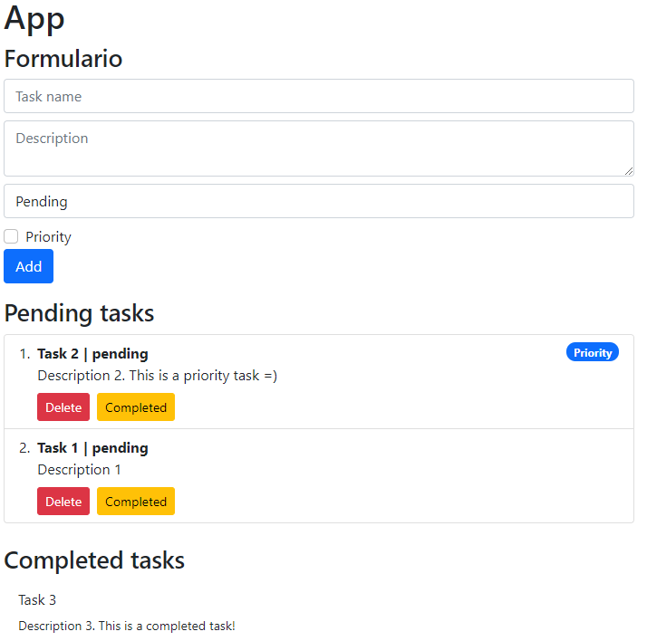
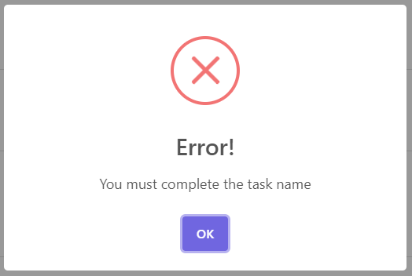

# ToDo App

This project was create with [ReactJS](https://reactjs.org/) by the using of hooks.
It is a task application, in which you can create, delete and complete. There is also a log of completed tasks. A task contains a title, a description, an option that allows you to choose whether the task is pending or completed, and finally, a checkbox to select whether it is of high priority. If the task has priority, it will be located at the top of the list of pending tasks.

## Library

The library I used was:

### [Sweet Alert 2](https://sweetalert2.github.io/)

The alerts that exist are when a task is created and when an error occurs, such as when you want to create a task with an empty field.

Add task:

Error:

### [Bootstrap 5](https://getbootstrap.com/)

All the layout of the application is done with `bootstrap 5`.

## Hooks

The hooks used were `useState`, `useEffect` and a custom hook called `useForm`.

### `useForm`

It has the function of obtaining the input of the form. It also has a method to reset the input.

## Website

You can find this website hosted at: [https://todo-app-cristiannd.netlify.app/]
